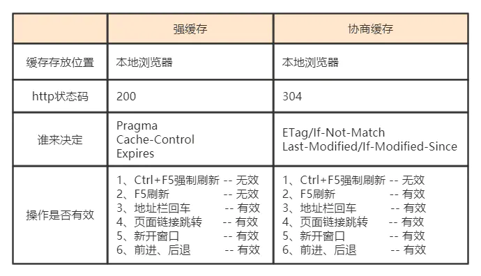
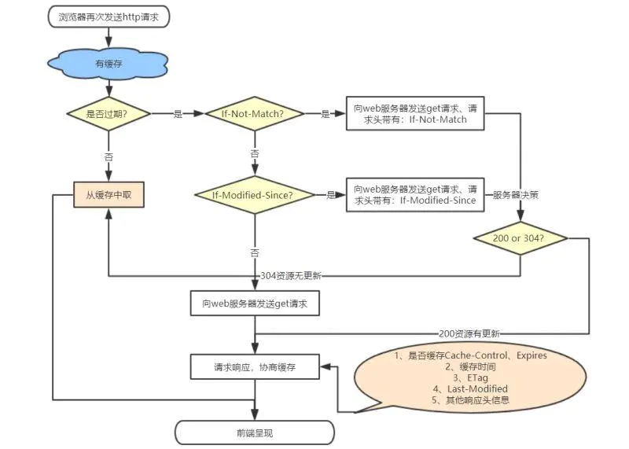

## 状态码
HTTP状态码总的分为五类： 
1开头：信息状态码 
2开头：成功状态码 
3开头：重定向状态码 
4开头：客户端错误状态码 
5开头：服务端错误状态码 

###  1XX：信息状态码
状态吗|含义|描述
---|---|---
100 | 继续 | 初始的请求已经接受，请客户端继续发送剩余部分
101	| 切换协议 | 请求这要求服务器切换协议，服务器已确定切换

### 2XX：成功状态码
状态吗|含义|描述
---|---|---
200	| 成功	| 服务器已成功处理了请求
201	| 已创建	| 请求成功并且服务器创建了新的资源
202	| 已接受	| 服务器已接受请求，但尚未处理
203	| 非授权信息	| 服务器已成功处理请求，但返回的信息可能来自另一个来源
204	| 无内容	| 服务器成功处理了请求，但没有返回任何内容
205	| 重置内容	| 服务器处理成功，用户终端应重置文档视图
206	| 部分内容	| 服务器成功处理了部分GET请求

### 3XX：重定向状态码
状态吗|含义|描述
---|---|---
300 |	多种选择	|	针对请求，服务器可执行多种操作
301	|	永久移动	|	请求的页面已永久跳转到新的url
302	|	临时移动	|	服务器目前从不同位置的网页响应请求，但请求仍继续使用原有位置来进行以后的请求
303	|	查看其他位置	|	请求者应当对不同的位置使用单独的GET请求来检索响应时，服务器返回此代码
304	|	未修改	|	自从上次请求后，请求的网页未修改过
305	|	使用代理	|	请求者只能使用代理访问请求的网页
307	|	临时重定向	|	服务器目前从不同位置的网页响应请求，但请求者应继续使用原有位置来进行以后的请求

### 4XX：客户端错误状态码
状态吗|含义|描述
---|---|---
400	| 错误请求	| 服务器不理解请求的语法
401	| 未授权	| 请求要求用户的身份演验证
403	| 禁止	| 服务器拒绝请求
404	| 未找到	| 服务器找不到请求的页面
405	| 方法禁用	| 禁用请求中指定的方法
406	| 不接受	| 无法使用请求的内容特性响应请求的页面
407	| 需要代理授权	| 请求需要代理的身份认证
408	| 请求超时	| 服务器等候请求时发生超时
409	| 冲突	| 服务器在完成请求时发生冲突
410	| 已删除	| 客户端请求的资源已经不存在
411	| 需要有效长度	| 服务器不接受不含有效长度表头字段的请求
412	| 未满足前提条件	| 服务器未满足请求者在请求中设置的其中一个前提条件
413	| 请求实体过大	| 由于请求实体过大，服务器无法处理，因此拒绝请求
414	| 请求url过长	| 请求的url过长，服务器无法处理
415	| 不支持格式	| 服务器无法处理请求中附带媒体格式
416	| 范围无效	| 客户端请求的范围无效
417	| 未满足期望	| 服务器无法满足请求表头字段要求

### 5XX：服务端错误状态码
状态吗|含义|描述
---|---|---
500	| 服务器错误	| 服务器内部错误，无法完成请求
501	| 尚未实施	| 服务器不具备完成请求的功能
502	| 错误网关	| 服务器作为网关或代理出现错误
503	| 服务不可用	| 服务器目前无法使用
504	| 网关超时	| 网关或代理服务器，未及时获取请求
505	| 不支持版本	| 服务器不支持请求中使用的HTTP协议版本

## http缓存
### 请求头简介

### cookie、sessionStorage、localStorage

### 首次请求流程

### 再次请求流程
